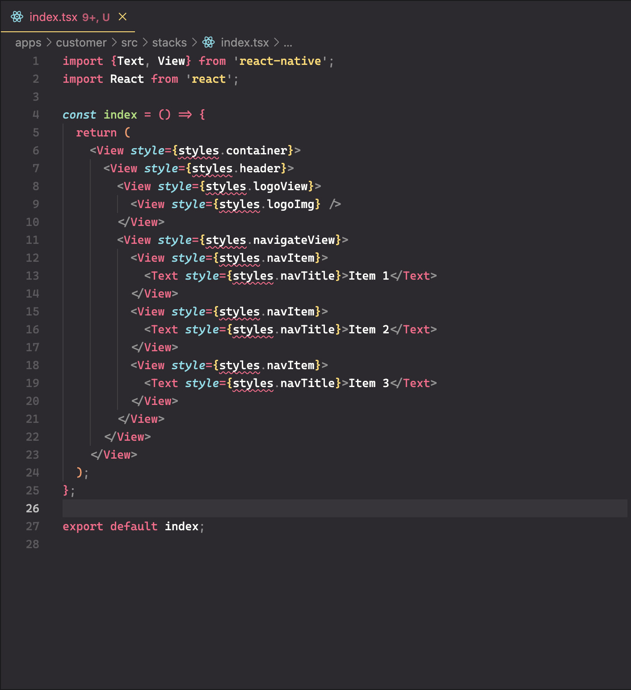
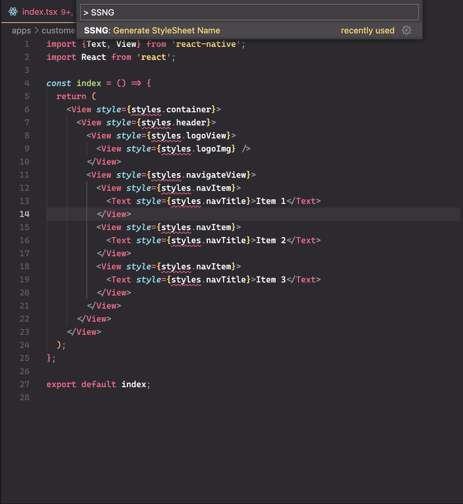
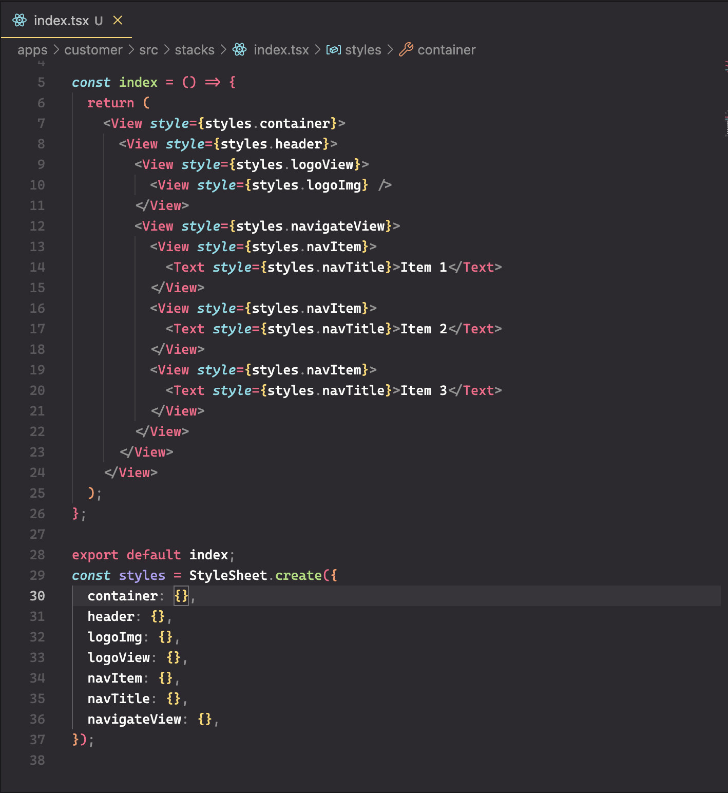

# Style Sheet name generator 

## Release Notes

Style Sheet name generate command

### 0.0.1

Initial release of [0.0.1](https://marketplace.visualstudio.com/items?itemName=Kha-ViNguyen.stylesheet-name-generator)

## Tutorial

- Open the active RN file
- `Ctrl/Command + Shift + P`
- `SSNG: Generate StyleSheet Name`
- Go to the end of file to implement for each StyleSheet name.
- Enjoy

## Screenshots

### SSNG: Generate StyleSheet Name

  
  
  

